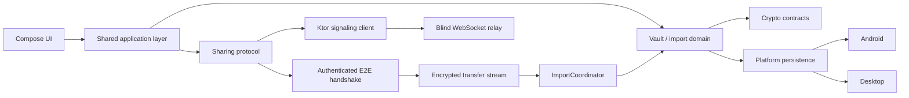

# VeilShare

**Privacy-first encrypted local vault and secure file sharing built with Kotlin Multiplatform.**

VeilShare is an experimental open-source project focused on keeping private files encrypted at rest while providing a small, auditable path for sharing them between trusted devices.

The project deliberately separates the **local vault security model** from the **network sharing layer**. Vault keys are never reused as network keys, the signaling server does not receive file plaintext or private file metadata, and received files enter the vault through the same durable import pipeline used by local imports.

> **Project status:** the local vault baseline is implemented and validated on Android and Desktop. Sharing V1 includes a blind Ktor WebSocket relay, authenticated end-to-end handshake, encrypted transfer stream, vault-import integration, retry handling, and protocol hardening. iOS remains a future/native-validation target.

## Why VeilShare?

Many private-file apps collapse storage, identity, networking, and UI into one security boundary. VeilShare takes the opposite approach:

- encrypted local storage first;
- independent logical vault contexts;
- durable and crash-aware imports/deletes;
- minimal server knowledge;
- independent cryptographic material for sharing;
- Kotlin Multiplatform for portable domain, protocol, crypto contracts, and UI logic;
- platform-specific code only where the operating system actually requires it.

## Current capabilities

### Local encrypted vault

- PIN-derived vault unlocking with **Argon2id**.
- **ChaCha20-Poly1305** authenticated encryption.
- **HKDF-SHA256** key separation.
- Encrypted catalogs and encrypted file blobs.
- Streaming file import instead of loading complete files into memory.
- Transactional persistence with journal/recovery semantics.
- Crash/fault-injection coverage around import, catalog replacement, delete, and recovery paths.
- Independent primary and alternate vault contexts with separate keys and storage state.
- Android and Desktop persistence implementations.
- Compose-based local vault UI for Android and Desktop.

### Sharing V1

- Random high-entropy reference codes.
- Ktor WebSocket signaling endpoint at `/v1/ws`.
- In-memory presence/session registries and rate limiting.
- Opaque relay payloads: the server routes bytes without receiving private file metadata.
- Authenticated handshake using **Ed25519** identities and **X25519** ephemeral key agreement.
- Direction-separated session traffic keys.
- Encrypted transfer stream.
- Transfer receiver integrated with the existing vault `ImportCoordinator`.
- Retry handling with exponential backoff.
- Concurrency and fault-injection tests for transfer components.
- Railway/Docker deployment configuration for the signaling relay.

## Architecture



The signaling service is intentionally **not** a file server. It handles registration, lookup, session coordination, and opaque relay traffic. File metadata such as filenames and MIME types belongs inside the end-to-end protected payload rather than the server-visible protocol.

## Security model

VeilShare follows a few non-negotiable rules:

1. **The authenticated catalog is the logical source of truth.**
2. **Corruption is not authorization to delete bytes.** Ambiguous data is preserved rather than guessed away.
3. **Vault keys and sharing keys are separate cryptographic domains.**
4. **Logical vault contexts must not become correlatable through a shared network identity.**
5. **Received network data cannot bypass the normal vault import transaction.**
6. **The relay is treated as untrusted.** Peer payloads must remain opaque to it.
7. **No custom cryptographic primitive is invented by the protocol.**

### Local crypto profile

The current local vault design uses:

- Argon2id for password/PIN key derivation;
- 16-byte salts;
- 32-byte derived keys;
- ChaCha20-Poly1305 with 96-bit nonces;
- 1 MiB encrypted file chunks;
- HKDF-SHA256 for context-specific key derivation.

Desktop and Android production providers use Bouncy Castle-backed implementations. The repository also contains protocol separation for Ed25519 signing and X25519 key agreement used by Sharing V1.

> **Security notice:** VeilShare is an experimental project and has not undergone an independent professional security audit. Do not treat the repository as a substitute for an audited product when protecting high-value or life-critical data.

## Platform status

| Area | Android | Desktop | iOS |
| --- | --- | --- | --- |
| Secure local core | ✅ Implemented / tested | ✅ Implemented / tested | 🚧 Planned / native validation pending |
| Local vault UI | ✅ | ✅ | 🚧 |
| Persistent encrypted storage | ✅ | ✅ | 🚧 |
| Sharing protocol code | ✅ KMP-compatible | ✅ KMP-compatible | 🚧 Native validation pending |
| Signaling client | ✅ | ✅ | 🚧 Native validation pending |

The validated product targets today are **Android and Desktop**. An `iosApp/` shell exists in the repository, but iOS is not part of the current Gradle module set and should not be considered release-ready. The signaling relay itself is a separate JVM/Ktor service.

## Repository layout

```text
VeilShare/
├── androidApp/                 # Android application
├── desktopApp/                 # Desktop Compose application
├── iosApp/                     # iOS shell / future native target
├── server/
│   └── signaling/              # Ktor blind signaling relay
├── shared/
│   ├── core-model/             # IDs, protocol DTOs and shared models
│   ├── core-crypto/            # Crypto contracts and providers
│   ├── core-vault/             # Vault, catalog, blobs, journal, import/delete
│   ├── core-identity/          # Sharing/device identity concepts
│   ├── core-transfer/          # Encrypted transfer pipeline
│   ├── core-contacts/          # Contact/reference-code domain
│   ├── core-platform/          # Platform-facing contracts and signaling client
│   ├── ui-design/              # Shared UI design primitives
│   ├── ui-features/            # Compose feature UI
│   └── app/                    # Shared application composition
└── docs/                       # Architecture, security, ADRs, tests and checkpoints
```

## Build and run

### Requirements

- JDK 17
- Android SDK for Android builds
- Windows, Linux, or macOS for JVM/Desktop development

### Desktop

```bash
# Windows
gradlew.bat :desktopApp:run

# Unix-like systems
./gradlew :desktopApp:run
```

### Android

```bash
# Windows
gradlew.bat :androidApp:assembleDebug

# Unix-like systems
./gradlew :androidApp:assembleDebug
```

### Signaling relay

```bash
# Windows
gradlew.bat :server:signaling:run

# Unix-like systems
./gradlew :server:signaling:run
```

The relay exposes the Sharing V1 WebSocket endpoint at:

```text
/v1/ws
```

## Tests

Examples of useful regression targets:

```bash
# Shared protocol/client + signaling server
gradlew.bat :shared:core-platform:allTests :server:signaling:test --no-daemon

# Core vault / crypto / transfer
gradlew.bat :shared:core-model:desktopTest :shared:core-crypto:desktopTest :shared:core-transfer:desktopTest :shared:core-vault:desktopTest :server:signaling:test --no-daemon
```

The project has dedicated coverage for protocol validation, identifier/reference-code handling, signaling registries, rate limiting, WebSocket relay behavior, encrypted vault persistence, recovery semantics, transfer concurrency, and fault injection.

## Sharing V1: intentionally simple

The current protocol deliberately avoids turning the first version into a networking research project.

**V1 uses:**

```text
Android / Desktop
       │
       │ encrypted peer protocol
       ▼
Ktor WebSocket relay
       │
       ▼
Android / Desktop
```

**V1 does not depend on:**

- WebRTC;
- STUN/TURN;
- direct P2P connectivity;
- byte-range resume;
- a server-side file database.

A disconnected transfer is restarted rather than maintaining complex partial-resume state.

## Privacy boundaries

The relay may inevitably observe coarse network information such as connection timing, opaque routing identifiers, frame sizes, and traffic volume. VeilShare therefore does **not** claim network anonymity or metadata invisibility.

The design instead aims to keep application-private information out of server-visible structures, including:

- filenames;
- MIME types;
- vault keys;
- file keys;
- local contact aliases;
- logical vault labels;
- plaintext file digests unless explicitly required by a future protocol revision.

## Documentation

The `docs/` directory contains the deeper engineering record:

- architecture and source-set strategy;
- security model and invariants;
- cryptographic ADRs;
- vault formats and persistence design;
- Sharing V1 protocol and threat model;
- platform-specific decisions;
- fault-injection/testing strategy;
- implementation checkpoints and agent worklogs.

Useful starting points:

- [`docs/MASTER_SPEC.md`](docs/MASTER_SPEC.md)
- [`docs/NON_NEGOTIABLES.md`](docs/NON_NEGOTIABLES.md)
- [`docs/adrs/`](docs/adrs/)
- [`docs/sharing/`](docs/sharing/)

Some early specification documents describe broader future ideas such as direct P2P transport. When those documents conflict with current code and newer checkpoints, **the implementation and current Sharing V1 documentation take precedence**.

## Non-goals

VeilShare does not promise:

- network anonymity;
- forensic secure deletion on flash storage;
- protection against a fully compromised operating system;
- perfect cryptographic deniability;
- invisible functionality hidden from platform review processes.

## Development philosophy

The secure local core is intentionally treated as a stable boundary. Changes to crypto formats, catalog/journal semantics, import commit behavior, or vault separation should be driven by reproducible bugs rather than opportunistic refactors.

For protocol work, the same principle applies: small changes, targeted tests, explicit security invariants, and no silent widening of what the server is allowed to learn.

---

**VeilShare is a codename used by the repository.** The final published application name, launcher identity, and store presentation may differ.