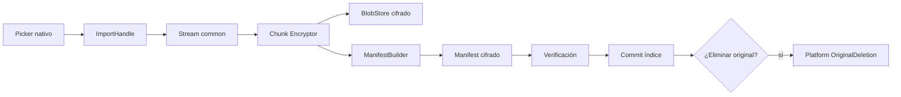
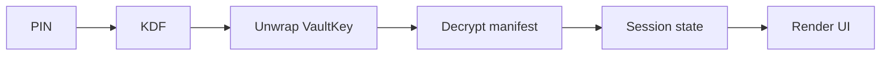
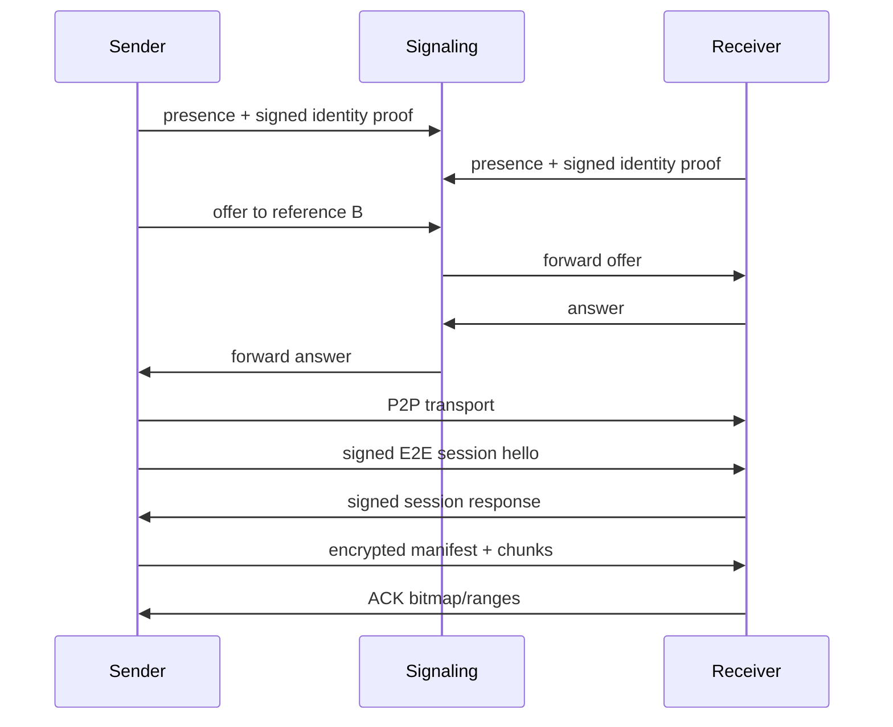

# Flujos de datos

## Importación

### Invariante
No se solicita borrar original antes de commit + verificación.

## Apertura

## Transferencia

## Receptor

El receptor no necesita escribir plaintext:
`wire ciphertext -> E2E decrypt chunk -> vault re-encrypt with receiver FileKey -> receiver BlobStore`.

Se acepta un buffer plaintext acotado en memoria durante el pipeline; debe limpiarse best-effort.
